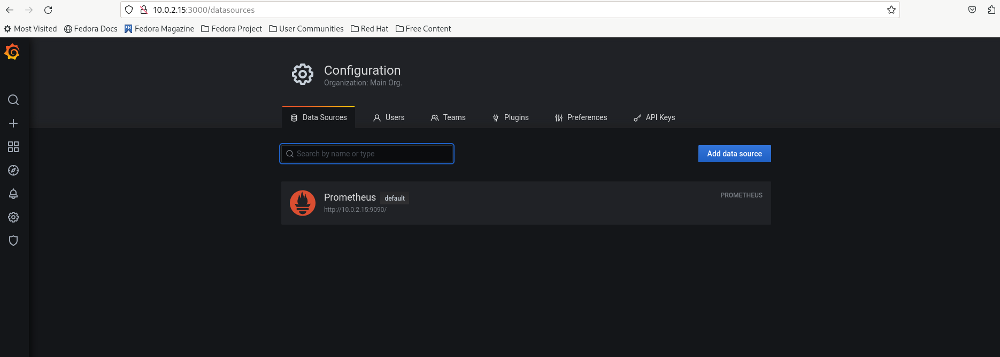
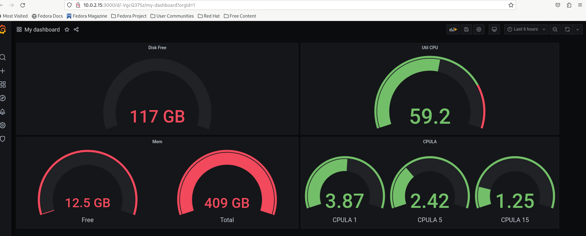
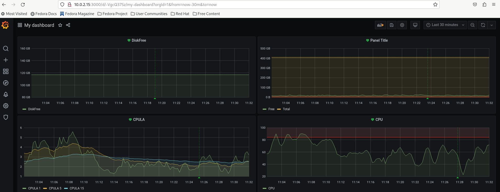

# Домашнее задание к занятию "10.02. Grafana"

---
## Задание 1:

1. Используя директорию [help](./help) внутри этого домашнего задания, запустите связку prometheus-grafana.
2. Зайдите в веб-интерфейс grafana, используя авторизационные данные, указанные в манифесте docker-compose.
3. Подключите поднятый вами prometheus, как источник данных.
4. Решение домашнего задания — скриншот веб-интерфейса grafana со списком подключенных Datasource.

### Ответ 1:



## Задание 2:

## Изучите самостоятельно ресурсы:

1. [PromQL tutorial for beginners and humans](https://valyala.medium.com/promql-tutorial-for-beginners-9ab455142085).
2. [Understanding Machine CPU usage](https://www.robustperception.io/understanding-machine-cpu-usage).
3. [Introduction to PromQL, the Prometheus query language](https://grafana.com/blog/2020/02/04/introduction-to-promql-the-prometheus-query-language/).

Создайте Dashboard и в ней создайте Panels:

- утилизация CPU для nodeexporter (в процентах, 100-idle);
- CPULA 1/5/15;
- количество свободной оперативной памяти;
- количество места на файловой системе.

Для решения этого задания приведите promql-запросы для выдачи этих метрик, а также скриншот получившейся Dashboard.

### Ответ 2:

- Создал Dashboard и в ней создал следующие Panels:
  - утилизация CPU для nodeexporter (в процентах, 100-idle):
    ```promql
    100 - (avg by (instance) (rate(node_cpu_seconds_total{mode="idle"}[1m])) * 100) 
    ```
  - CPULA 1/5/15:
    ```promql
    node_load1
    node_load5
    node_load15y
    ```
  - количество свободной оперативной памяти и сколько всего:
    ```promql
    (node_memory_MemFree_bytes) * 100
    (node_memory_MemTotal_bytes) * 100
    ```
  - количество места на файловой системе:
    ```promql
    node_filesystem_size_bytes{device="/dev/sda3",mountpoint="/"}
    ```


## Задание 3:

1. Создайте для каждой Dashboard подходящее правило alert — можно обратиться к первой лекции в блоке «Мониторинг».
2. В качестве решения задания приведите скриншот вашей итоговой Dashboard.

### Ответ 3:



## Задание 4:

1. Сохраните ваш Dashboard.Для этого перейдите в настройки Dashboard, выберите в боковом меню «JSON MODEL». Далее скопируйте отображаемое json-содержимое в отдельный файл и сохраните его.
2. В качестве решения задания приведите листинг этого файла.

### Ответ 4:

- [Dashboard](Dashboard.json)